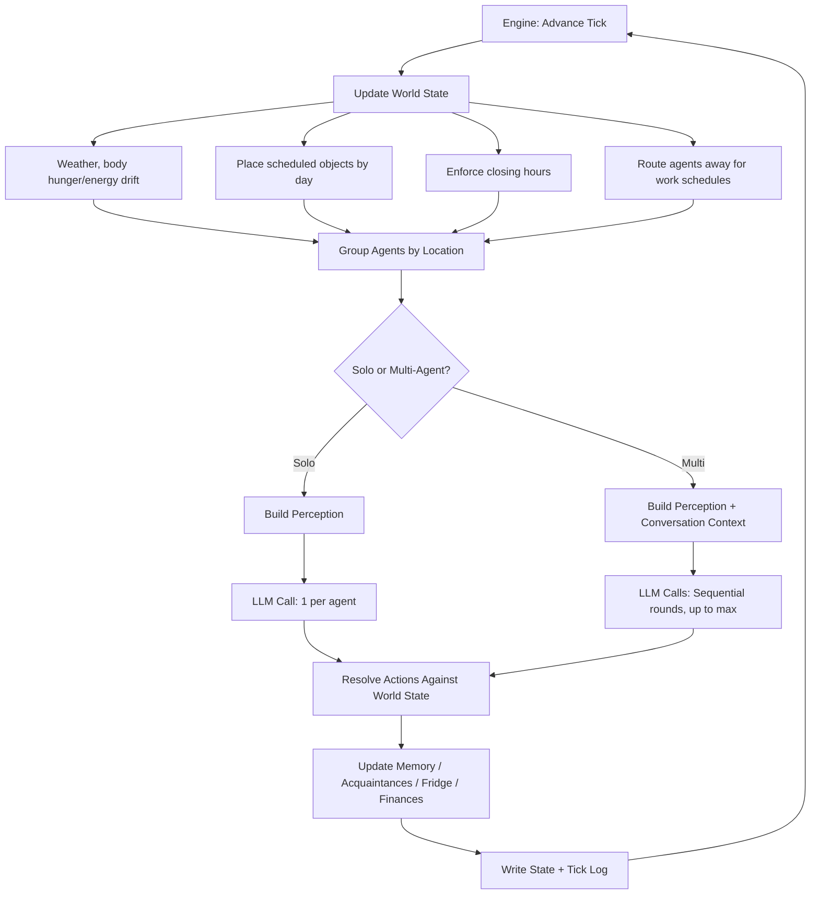
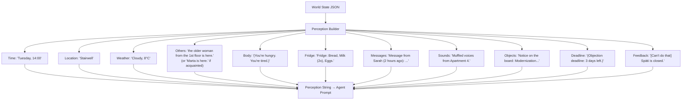
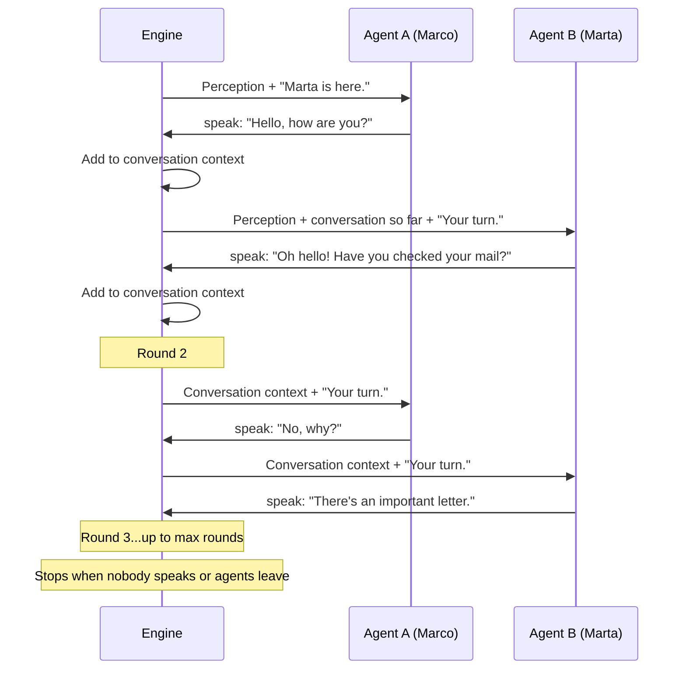
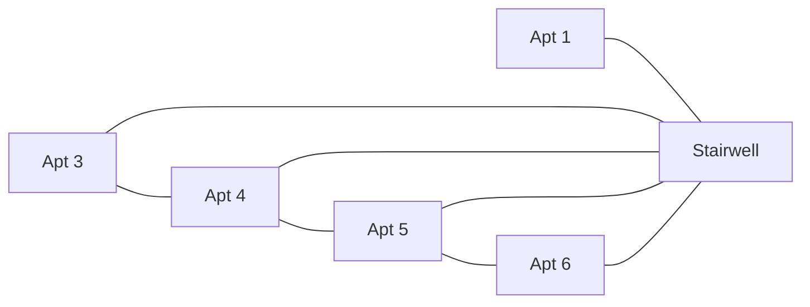

# Social World Model Agentic Simulation

**The environment is the personality.**

6 LLM agents live in a Berlin apartment building. They receive no personality, no behavioral instructions, no goals. Each agent gets a two-line seed — name, age, job, apartment — and a structured world that enforces physics: hunger, fatigue, locked doors, opening hours, adjacency-based sound, phone number requirements.

The agents don't produce interesting behavior because they're told to. They produce it because the environment constrains what's possible. A retired woman who is always home will encounter more neighbors than a construction worker who leaves at 8am. That's not personality. That's architecture.

---

## How It Works

### The Core Loop

Every simulated hour, the engine builds a perception for each agent, calls the LLM once, and resolves the returned actions against world state.



The agent sees the world. The agent acts. The engine resolves. That's it.

### What the Agent Actually Receives

This is the **entire prompt** for one agent turn. No system prompt. No personality instructions. No chain-of-thought scaffolding.

```
You are Marta.

Marta. 62. Retired. Lives alone in Apartment 1, 1st floor.
25 years here. Widowed.

Locations in the building: Apartment 1-6, Stairwell, Entrance Hall,
Mailboxes (ground floor), Backyard. Outside: Späti, Zum Anker.
Your mailbox is at the Mailboxes on the ground floor — you need to
use move_to to get there.

# Marta

## People
- Rolf: quiet, but kind when you catch him

## Experiences
Monday 09:00. Apartment 1. You are alone.
Monday 14:00. Stairwell. the young man from the 3rd floor was there.
Said: "Hello." Went to Backyard.
Night. Slept (well). New day.
Tuesday 08:00. Apartment 1. You are alone.

## Important
*(Nothing)*

---

Tuesday, 10:00. Stairwell. Cloudy, 8°C.
You are alone.
(You're hungry.)

Respond ONLY with a JSON object:
{ "actions": [ { "type": "think", "text": "..." }, ... ] }

Available actions:
- think / speak / do / wait / move_to / check_mailbox / read
- knock_door / lock_door / unlock_door / send_message / phone_call
- leave_note / file_objection / check_deadline
```

That's **~200 tokens of structure** plus variable perception and memory. No "you are a caring person." No "you tend to check on your neighbors." The environment creates those behaviors:

- Marta is hungry → she might go to the Späti
- She's in the stairwell → she might see someone
- She has no memories of interaction → she has nothing to reference

Everything the agent knows comes from what the engine fed it. Everything it can do is constrained by the action schema. The engine is the personality.

---

## The Architecture in Detail

### Engine vs. Agent: Who Controls What

```mermaid
flowchart LR
    subgraph ENGINE ["Engine (deterministic)"]
        direction TB
        E1[Time + Weather]
        E2[Body State: hunger, energy, sleep]
        E3[Location + Opening Hours]
        E4[Sound Propagation]
        E5[Object Placement by Schedule]
        E6[Acquaintance Gating]
        E7[Phone System]
        E8[Memory Compression]
        E9[Fridge + Finances]
        E10[Endgame Tracking]
    end

    subgraph AGENT ["Agent (LLM, single call)"]
        direction TB
        A1[Choose action: speak/move/wait/...]
        A2[Generate dialogue content]
        A3[Decide social initiative]
    end

    subgraph RESOLVE ["Resolution (deterministic)"]
        direction TB
        R1[Validate action against world rules]
        R2[Update world state]
        R3[Write to memory file]
    end

    ENGINE -->|perception string| AGENT
    AGENT -->|JSON actions| RESOLVE
    RESOLVE -->|state changes| ENGINE
```



The split is intentional. The engine handles **everything that would otherwise require instructing the agent**:

| Without engine enforcement | With engine enforcement |
|---|---|
| "Don't use names of people you haven't met" | Acquaintance system renders unknown agents as "the young man from the 3rd floor" |
| "You're getting hungry, consider eating" | Body state drift injects `(You're hungry.)` into perception |
| "The bar is closed at night" | Closing-hour enforcement moves agents home automatically |
| "You can only call people whose number you have" | Phone contacts list is checked; action rejected if no number |
| "Remember what happened yesterday" | Memory file is rebuilt from actions each tick, compressed over time |
| "Don't have the same conversation twice" | Interaction cooldown suppresses repeat encounters within 3 ticks |

Every row is a **prompt instruction we never had to write** because the engine handles it structurally.

### Tick Structure

```
1 tick = 1 simulated hour, 07:00–22:00 (16 ticks/day)
Night is skipped: body resets, sleep memory injected

Tick 1   = Monday 07:00
Tick 16  = Monday 22:00
Tick 17  = Tuesday 07:00
...
Tick 224 = Sunday 22:00 (Day 14)
```

### Perception Builder

The engine constructs each agent's perception from world state. The agent never reads world state directly.



Key design decisions:
- **Acquaintance gating**: Agents who haven't spoken don't know each other's names. The engine replaces names with physical descriptions ("the man from the 2nd floor") until they've had a conversation.
- **Sound propagation**: Apartments have an adjacency map. Loud actions in Apartment 3 are audible as "Loud music from Apartment 3" in Apartment 4 and the Stairwell. This creates awareness without direct interaction.
- **Fridge tracking**: The engine tracks individual food items. Eating removes items. Shopping at the Späti adds items. When the fridge is empty, the agent sees "Fridge: empty." — creating natural pressure to go shopping.

### Action Resolution

The agent returns JSON. The engine validates and resolves every action against world rules.

```typescript
// Agent returns:
{ "actions": [
    { "type": "move_to", "location": "Späti" },
    { "type": "speak", "text": "Need some bread." }
]}

// Engine resolves:
// 1. Is Späti open? (check hours: 7-22) → Yes → move agent
// 2. Is anyone else at Späti? → inject speech into conversation
// 3. Detect shopping keywords → add Bread to home fridge
// 4. Deduct €5-15 from agent's balance
```

Actions that violate world rules get rejected with feedback:
- `move_to "Zum Anker"` at 14:00 → `[Can't do that] Zum Anker is closed.`
- `phone_call "Suki"` without her number → `You don't have Suki's number. You need to exchange numbers first.`
- `check_mailbox` from the 3rd floor → `You're not at the mailboxes. Go to the ground floor first.`

These rejections are injected into the agent's next perception as `[feedback]`, so it learns from failed actions without any instruction.

### Memory System

Each agent has a markdown memory file with three sections:

```markdown
# Marco

## People
- Sarah: my girlfriend, we live together
- Marta: friendly, always in the stairwell

## Experiences
Monday 07:00. Apartment 5. Sarah was there. Said: "Morning."
Monday 10:00. Stairwell. the older woman from the 1st floor was there.
Monday 14:00. Späti. Bought bread and milk.
Night. Slept (well). New day.
Tuesday 08:00. Apartment 5. You are alone. Sarah is away (Work (daycare)).

## Important
- Tuesday, 11:00: Werther & Partner Law Firm... termination of tenancy...
```

The engine writes to this file after every tick. The agent reads it at the start of every turn. This creates a **feedback loop without any prompt engineering**:

1. Agent speaks to Rolf → engine writes `"Said: 'Have you seen the letter?'"` to memory
2. Next tick, agent reads its own memory → sees it talked to Rolf about the letter
3. Agent now has context for follow-up actions

**Compression**: The 20 most recent entries stay verbatim. Older entries are compressed into summaries: `[Monday]: Met Marta, Sarah. Routine.` This prevents context window overflow while preserving relationship history.

### Conversation Mechanics

When multiple agents are at the same location, the engine runs sequential conversation rounds:



**Encounter types** limit conversation length by location:
- **Passing** (Stairwell, Entrance Hall, Mailboxes): max 2 rounds
- **Coincidence** (Backyard, Späti, Zum Anker): max 8 rounds
- **Deliberate** (inside apartments after knocking): max 8 rounds

**Interaction cooldown**: If the same agents were at the same location within the last 3 ticks and nothing new happened (no new messages, no new arrivals), the engine suppresses the interaction. Each agent still gets a solo LLM call but no conversation context. This prevents infinite small-talk loops.

### Service Staff

Zum Anker (bar) and Späti (corner shop) have deterministic service NPCs. When an agent says something matching ordering patterns, the engine injects staff responses:

```
Agent speaks: "I'll have a beer and some lentil soup please."
Engine detects: beer (€3.80) + lentil soup (€8.50)
Engine injects: Waiter: "Got it. Beer, Lentil soup with bread. Coming right up."
Next round:     Waiter brings Beer and Lentil soup with bread to the table.
Engine deducts: €12.30 from agent's balance
```

No LLM call for the waiter. Pure pattern matching. The agents experience these locations as living spaces rather than empty rooms.

---

## The Building

```
Schillerstraße 14, Berlin-Neukölln

┌─────────────────────────────────┐
│  Top floor   │ Apt 6  (Suki)   │
├──────────────┼─────────────────┤
│  3rd floor   │ Apt 5  (Marco   │
│              │        & Sarah) │
│              │ Apt 4  (Hakim)  │
├──────────────┼─────────────────┤
│  2nd floor   │ Apt 3  (Rolf)   │
├──────────────┼─────────────────┤
│  1st floor   │ Apt 1  (Marta)  │
│              │ Apt 2  (empty)  │
├──────────────┼─────────────────┤
│  Ground fl.  │ Entrance Hall   │
│              │ Mailboxes       │
├──────────────┼─────────────────┤
│  Outside     │ Backyard        │
│              │ Späti           │
│              │ Zum Anker (bar) │
└──────────────┴─────────────────┘
```

### The Agents

| Agent | Age | Occupation | Apartment | Schedule | Seed |
|-------|-----|-----------|-----------|----------|------|
| **Marco** | 24 | Web developer (remote) | Apt 5 | Always home | 2 lines |
| **Sarah** | 24 | Daycare worker | Apt 5 | Away Wed-Fri 8-15 | 2 lines |
| **Marta** | 62 | Retired, widowed | Apt 1 | Always home | 2 lines |
| **Rolf** | 55 | Construction worker | Apt 3 | Away Mon-Fri 8-17 | 2 lines |
| **Hakim** | 38 | IT consultant | Apt 4 | Away Mon-Fri 9-18 | 2 lines |
| **Suki** | 23 | Student | Apt 6 | Away some weekdays 8-12 | 2 lines |

The schedule column is the entire behavioral explanation. Marta and Marco are home all day — they encounter more people. Rolf and Hakim are gone 9+ hours — they're structurally isolated. No personality prompt needed.

### Sound Adjacency Map



When an agent plays loud music in Apt 3, agents in Apt 4 and the Stairwell perceive: `"Loud music from Apartment 3."` This creates organic awareness — agents can hear their neighbors exist without ever meeting them.

---

## The Endgame

On Day 7, eviction letters appear in every mailbox. The simulation now has a win condition.

### Event Timeline

| Day | Event |
|-----|-------|
| 7 | Eviction letters appear in mailboxes |
| 7 | SMS sent: "Check your mailbox" |
| 8 | Law firm ad posted (after anyone reads letter) |
| **14** | **Objection deadline (22:00)** |
| 14 | Renovation notice posted in stairwell |
| 21 | Buyout offers appear in mailboxes |
| 30 | Investor visit |

### Tracking

The engine tracks three state variables — none of which the agents are told about:

- **`brief_knowledge[agent]`**: `true` when agent reads the eviction letter OR hears about it in conversation (engine scans speech for keywords like "eviction", "letter", "objection")
- **`objection_signers[agent]`**: `true` when agent expresses agreement in conversation (engine scans for "yes", "sign", "count me in", "of course", etc.)
- **`objection_filed`**: `true` when any agent uses `file_objection` with ≥4 signers and all tenants informed

The agents don't know these variables exist. They just talk. The engine interprets.

### Win Condition

**PASS**: `objection_filed === true` before Day 14 22:00, with `≥4` signers and all 6 tenants in `brief_knowledge`.

**FAIL**: Deadline passes.

---

## What Emerges

None of this is explicitly instructed. These patterns emerged in testing, driven by structural constraints:

1. **Marta becomes the social hub** — not because she's told to be social, but because she's retired (always home) and lives on the 1st floor (near the entrance). Schedule + location = social role.

2. **Rolf is the hardest to reach** — he works Mon-Fri 8-17, comes home with low energy, and has no existing connections. The engine's body state system makes him less likely to act when tired. His isolation is structural.

3. **Marco and Sarah drift** — they share an apartment but have different schedules. The cooldown system means they don't have meaningful conversations when nothing new happens. Proximity without novelty = routine.

4. **Information spreads through the social graph** — agents who met during Days 1-6 become information conduits for the eviction letter. The acquaintance + phone contact system means you can only text people you've met. Social infrastructure built during "boring" days determines crisis response.

5. **Collective action requires physical infrastructure** — to organize, agents need phone numbers (requires meeting), awareness (requires reading or hearing), and agreement (requires conversation). The causal chain: be in same place → speak → exchange numbers → text about letter → agree → file. Every link is enforced by the engine.

---

## Interview Mode

Talk to any agent mid-simulation:

```bash
npm run interview -- Suki
```

The agent responds from its memory file and current state only. If Suki hasn't heard about the eviction, she can't talk about it.

---

## Setup

### Prerequisites

- Node.js 18+
- [Anthropic API key](https://console.anthropic.com/)

### Quick Start

```bash
git clone https://github.com/Dominien/social-agent-sim.git
cd social-agent-sim
npm install
cp .env.example .env
# Add your ANTHROPIC_API_KEY to .env
npm run reset && npm start
```

### Commands

| Command | Description |
|---------|-------------|
| `npm start` | Start simulation from tick 1 |
| `npm run resume` | Continue from last tick |
| `npm run tick` | Run a single tick |
| `npm run reset` | Reset to clean initial state |
| `npm run interview -- <Name>` | Interview an agent |
| `npm run viewer` | Start web viewer API |

### Environment Variables

| Variable | Default | Description |
|----------|---------|-------------|
| `ANTHROPIC_API_KEY` | (required) | Anthropic API key |
| `CHARACTER_MODEL` | `haiku` | `haiku` (~$0.50/sim day) or `sonnet` (~$5/sim day) |
| `LOG_LEVEL` | `normal` | `minimal` / `normal` / `verbose` |
| `TICK_INTERVAL_MS` | `0` | Delay between ticks (ms) |

### Project Structure

```
social-agent-sim/
├── src/
│   ├── engine.ts           # Main loop, perception builder, conversation handler
│   ├── agent-runner.ts     # Prompt construction (the lean part), LLM call
│   ├── tools.ts            # Action schema + resolution against world rules
│   ├── types.ts            # World state types, location constants
│   ├── time.ts             # Tick → simulated time conversion
│   ├── memory.ts           # Memory read/write/compression
│   ├── body.ts             # Hunger, energy, sleep quality drift
│   ├── finances.ts         # Income, rent, spending tracking
│   ├── doors.ts            # Lock/unlock/knock resolution
│   ├── sounds.ts           # Adjacency-based sound propagation
│   ├── messages.ts         # SMS and phone call queuing
│   ├── away.ts             # Work/university schedules
│   ├── environment-agent.ts # Weather, object placement, mailbox
│   ├── interview.ts        # Post-simulation interview mode
│   ├── index.ts            # CLI, reset logic, initial world state
│   ├── llm.ts              # Claude API wrapper
│   └── server.ts           # Web viewer API
├── data/
│   ├── profiles/           # 2-line agent seeds
│   ├── memory/             # Live memory files (mutated each tick)
│   ├── memory_initial/     # Clean templates (restored on reset)
│   ├── object_content/     # Letter and notice full text
│   ├── object_schedule.json
│   ├── ground_truth.json   # Financial facts (injected contextually)
│   └── world_state.json    # Full simulation state
└── data/logs/              # Per-tick JSON logs
```

### API (Web Viewer)

| Endpoint | Returns |
|----------|---------|
| `GET /api/state` | Current world state |
| `GET /api/agents` | All agent locations + status |
| `GET /api/agent/:name` | Agent details + memory |
| `GET /api/ticks` | Available tick logs |
| `GET /api/tick/:n` | Single tick log |
| `GET /api/objects` | All world objects |

---

## The Point

Most agent frameworks give LLMs a persona and hope for the best. This project inverts it: **build the world, not the character.** The prompt is deliberately barren — two lines of identity, a list of actions, and whatever the engine decides the agent can currently perceive.

The engine does the heavy lifting. It enforces hunger. It enforces locked doors. It enforces that you can't call someone whose number you don't have. It enforces that you can't know about an eviction letter you haven't read. The two-line seed gives the model cultural priors from pretraining — it knows what "retired widow" or "construction worker" implies. But the environment decides which of those priors get expressed. Every "personality trait" that emerges — Marta's sociability, Rolf's isolation, Marco and Sarah's domestic routine — is a consequence of structural constraints channeling those priors, not prompt engineering.

The agent just acts inside the world. The world makes the agent who they are.

---

## Author

Built by **Marco Patzelt** — [marcopatzelt7@gmail.com](mailto:marcopatzelt7@gmail.com) · [@Dominien](https://github.com/Dominien)

---

## License

MIT — see [LICENSE](LICENSE).
